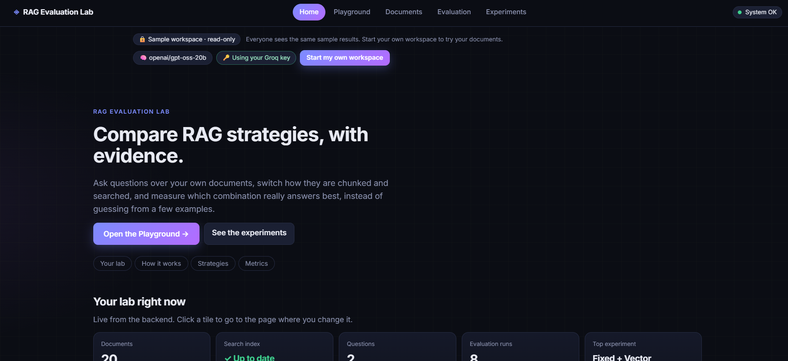
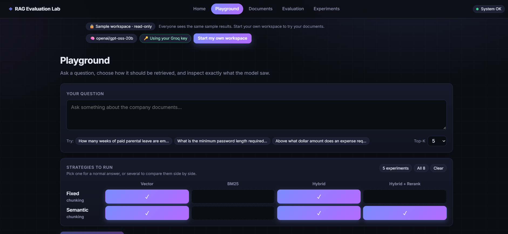
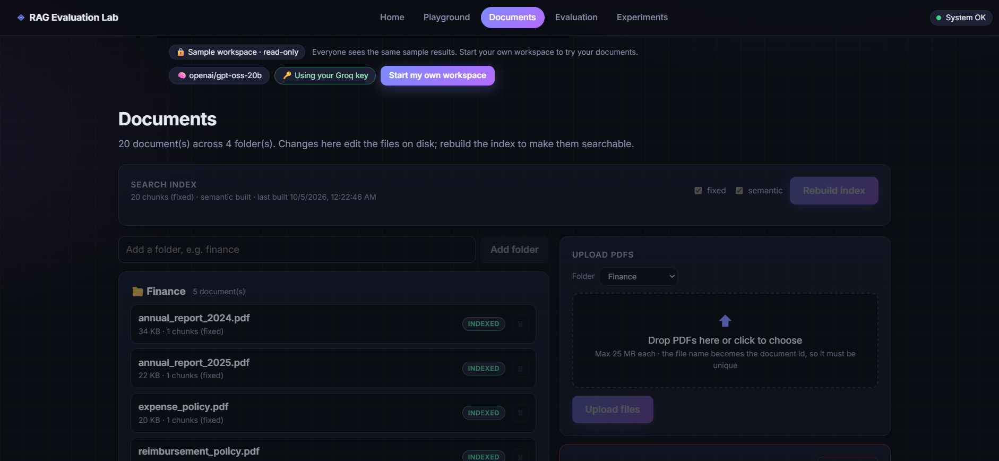
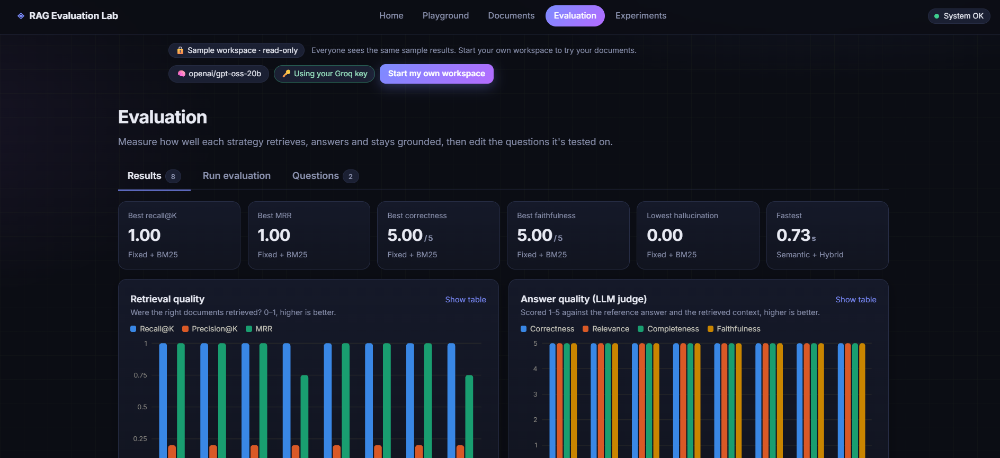
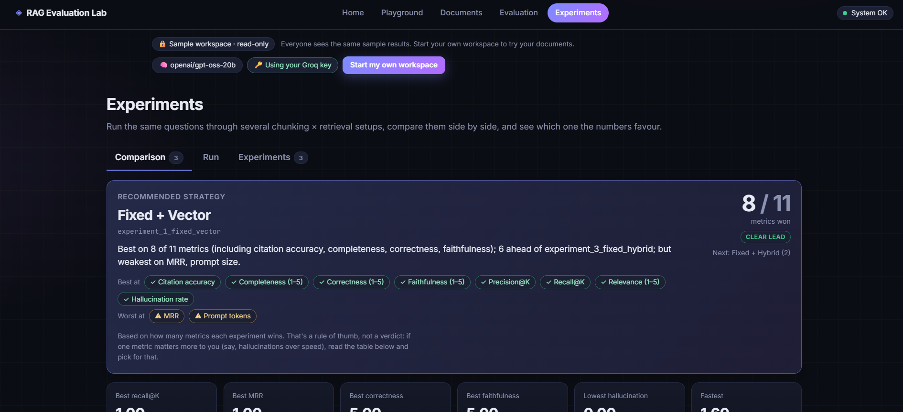

<div align="center">

# 🧪 RAG Evaluation Lab

### Stop guessing which RAG setup is best. Measure it. 📊

Ask questions over your own documents, switch how they are chunked and searched,
and see — with numbers — which combination actually answers best.


</div>

---

## 📖 What is this?

Building a RAG (Retrieval-Augmented Generation) system is easy. Knowing whether it is **good** is hard.
Most people try three or four questions, see a nice answer, and ship it.

**RAG Evaluation Lab** is a full-stack playground that turns that guesswork into evidence. You upload PDFs, pick a
chunking method and a retrieval strategy, ask questions, and then run a proper evaluation that scores every
combination on retrieval quality, answer quality, grounding, citations, speed and cost.

> 💡 One question it answers: _"Is hybrid search with a reranker actually worth the extra latency for my documents?"_

---

## ✨ Features

|                                  |                                                                                                                                        |
| -------------------------------- | -------------------------------------------------------------------------------------------------------------------------------------- |
| 💬 **Playground**                | Ask a question and get an answer with citations, the exact passages that were retrieved, and timings. Compare strategies side by side. |
| 📚 **Document library**          | Upload PDFs, rebuild the index, delete documents, or reset the whole library from the browser.                                         |
| ✂️ **Two chunking methods**      | Fixed-size chunks, or semantic chunks that split where the meaning changes.                                                            |
| 🔎 **Four retrieval strategies** | Vector search, BM25 keyword search, hybrid, and hybrid + cross-encoder reranker.                                                       |
| 📝 **Evaluation**                | Build a question set, run it against a strategy, and get scores with a per-question breakdown and heatmap.                             |
| 🧫 **Experiments**               | Run many strategy combinations on the same questions, compare them in charts, and get a recommendation.                                |
| 🏠 **Multi-workspace hosting**   | A read-only sample for everyone, plus a private workspace per visitor. Visitors bring their own API key.                               |
| 🤖 **Model choice**              | Pick the LLM from a dropdown, or type any model name. Works with Groq or any OpenAI-compatible API (e.g. Gemini).                      |
| 🔍 **Tracing (optional)**        | LangSmith tracing and experiments for local debugging.                                                                                 |

---

## 🧠 How it works

```
                 ┌──────────────────────── INDEXING (once per document set) ───────────────────────┐
  📄 PDFs  ─►  🧹 Read & clean  ─►  ✂️ Chunk (fixed / semantic)  ─►  🧮 Embed & index (vectors + BM25)
                 └─────────────────────────────────────────────────────────────────────────────────┘

                 ┌──────────────────────── ANSWERING (every question) ────────────────────────────┐
  ❓ Question ─►  🔎 Retrieve top-K  ─►  🧾 Build prompt  ─►  🤖 LLM  ─►  ✅ Answer + citations
                 └─────────────────────────────────────────────────────────────────────────────────┘

                 ┌──────────────────────── EVALUATING (per question set) ─────────────────────────┐
  📋 Questions + expected answers ─► run pipeline ─► 📏 retrieval · answer · grounding · system metrics
                 └─────────────────────────────────────────────────────────────────────────────────┘
```

### 🔎 Retrieval strategies

| Strategy            | How it finds passages                                  | Good at                     |
| ------------------- | ------------------------------------------------------ | --------------------------- |
| **Vector**          | Compares meaning using embeddings                      | Paraphrased questions       |
| **BM25**            | Classic keyword matching                               | Exact terms, names, numbers |
| **Hybrid**          | Combines vector and BM25 results                       | A solid all-rounder         |
| **Hybrid + rerank** | Hybrid, then a cross-encoder re-scores the top results | Best precision, slowest     |

### ✂️ Chunking strategies

| Strategy     | Idea                                                                   |
| ------------ | ---------------------------------------------------------------------- |
| **Fixed**    | Cut text into pieces of a set size with overlap. Fast and predictable. |
| **Semantic** | Cut where the topic shifts, so each chunk is about one thing.          |

### 📏 What gets measured

| Group                        | Examples                                                                                |
| ---------------------------- | --------------------------------------------------------------------------------------- |
| 🎯 **Retrieval**             | Did the right passages come back, and how high were they ranked?                        |
| ✍️ **Answer quality**        | LLM judges score correctness and completeness against the expected answer               |
| 🧷 **Grounding & citations** | Is every claim supported by the retrieved text, and do citations point to real sources? |
| ⚙️ **System**                | Latency per stage, tokens used                                                          |

---

## 🖥️ Screens

| Page               | What you do there                                             |
| ------------------ | ------------------------------------------------------------- |
| 🏡 **Home**        | Understand the pipeline, see the live state of your lab       |
| 🛝 **Playground**  | Ask questions, inspect retrieved passages, compare strategies |
| 📂 **Documents**   | Upload PDFs, rebuild the index, reset the library             |
| 📊 **Evaluation**  | Manage questions, run an evaluation, read the results         |
| 🧪 **Experiments** | Compare strategy combinations and read the recommendation     |

### 📸 Application Screenshots

<table>
  <tr>
    <td align="center">
      <strong>🏡 Home</strong><br>
      
    </td>
    <td align="center">
      <strong>🛝 Playground</strong><br>
      
    </td>
    <td align="center">
      <strong>📂 Documents</strong><br>
      
    </td>
  </tr>
  <tr>
    <td align="center">
      <strong>📊 Evaluation</strong><br>
      
    </td>
    <td align="center">
      <strong>🧪 Experiments</strong><br>
      
    </td>
    <td></td>
  </tr>
</table>

---

## 🧰 Tech stack

| Layer                | Tools                                                                                                  |
| -------------------- | ------------------------------------------------------------------------------------------------------ |
| 🐍 **Backend**       | FastAPI, Pydantic / pydantic-settings, Uvicorn                                                         |
| 🧮 **Retrieval**     | sentence-transformers (`all-MiniLM-L6-v2`), rank-bm25, cross-encoder (`ms-marco-MiniLM-L-6-v2`), NumPy |
| 📄 **Documents**     | pypdf, tiktoken                                                                                        |
| 🤖 **LLM**           | Groq (default) or any OpenAI-compatible API                                                            |
| 🔭 **Observability** | LangSmith (optional)                                                                                   |
| ⚛️ **Frontend**      | React 18, Vite, React Router, Recharts                                                                 |
| 🧪 **Tests**         | pytest, Playwright (end-to-end checks)                                                                 |
| 🐳 **Deploy**        | Docker, Hugging Face Spaces, Vercel for the UI                                                         |

---

## 🗂️ Project structure

```
.
├── 🐳 Dockerfile
├── 📦 requirements.txt · pyproject.toml
├── 📘 README.md
├── 🧫 experiments/              saved experiment runs
├── 🐍 backend/
│   ├── app/
│   │   ├── api/                 routes: query, documents, evaluation, experiments, jobs, config, workspaces
│   │   ├── core/                settings, dependencies, background jobs, workspaces
│   │   ├── ingestion/           PDF reading, cleaning, chunking, index building
│   │   ├── embeddings/          sentence-transformers embedder
│   │   ├── retrieval/           vector, BM25, hybrid, reranker
│   │   ├── generation/          prompts and answer generation
│   │   ├── evaluation/          datasets, metrics, runner
│   │   ├── experiments/         runner, comparison, recommendation
│   │   └── main.py              FastAPI app
│   ├── scripts/                 command-line tools
│   ├── tests/                   pytest suite
│   └── data/                    documents · processed · evaluation · workspaces
└── ⚛️ frontend/
    └── src/                     pages · components · charts · services · context
```

---

## 🚀 Quick start

**1️⃣ Backend** (Python 3.11+)

```bash
python -m venv .venv && source .venv/bin/activate      # Windows: .venv\Scripts\activate
pip install -r requirements.txt
cp .env.example .env                                     # add your GROQ_API_KEY
cd backend
uvicorn app.main:app --reload --port 8000
```

**2️⃣ Frontend** (Node 18+), in a second terminal

```bash
cd frontend
npm install
npm run dev
```

**3️⃣ Open** the address Vite prints (usually http://localhost:5173) and head to the **Documents** page to upload a PDF. 🎉

**🧪 Run the tests:** `cd backend && pytest`

---

## ⚙️ Configuration

Settings are environment variables, read from `.env` in the repo root. Use plain `NAME=value` lines.

| Variable             | What it does                                     | Default              |
| -------------------- | ------------------------------------------------ | -------------------- |
| `GROQ_API_KEY`       | Your LLM API key                                 | –                    |
| `GROQ_BASE_URL`      | API endpoint (change it to use another provider) | Groq                 |
| `GROQ_MODEL`         | Default model                                    | `openai/gpt-oss-20b` |
| `GROQ_MODEL_OPTIONS` | Comma-separated models shown in the dropdown     | 5 models             |
| `ALLOW_CUSTOM_MODEL` | Let users type any model name                    | `true`               |
| `APP_MODE`           | `local` or `hosted`                              | `local`              |
| `CORS_ORIGINS`       | Frontend addresses allowed to call the API       | –                    |

---

## 🌍 Hosting for other people

`APP_MODE=hosted` and the app becomes safe to share:

- 👀 **Sample workspace** — your committed data, visible to everyone, read-only.
- 🔐 **Private workspaces** — each visitor gets their own documents, index, questions and results, kept in their browser.
- 🔑 **Bring your own key** — visitors paste their own Groq key; it is never stored on your server.
- 🧹 **Auto-cleanup** — idle workspaces are deleted after 7 days.
- 🛡️ **Limits** — caps on workspaces, uploads and concurrent jobs protect your server.

---

## 🔌 API at a glance

Interactive docs are available at `/docs` when the backend is running.

| Area           | Purpose                                                      |
| -------------- | ------------------------------------------------------------ |
| `/query`       | Ask a question with a chosen chunking and retrieval strategy |
| `/documents`   | Upload, list, delete, rebuild the index, reset the library   |
| `/evaluation`  | Manage questions, start runs, read results                   |
| `/experiments` | Run and compare experiments                                  |
| `/jobs`        | Track long-running background jobs                           |
| `/config`      | System status and available models                           |
| `/workspaces`  | Create, inspect and delete private workspaces                |

---

## 🗺️ Ideas for the future

- 🌐 Support more document types (Word, web pages)
- 🧩 More retrieval strategies (query rewriting, multi-query)
- 📤 Export evaluation reports
- 👥 Shareable results links

---

## 🙌 Acknowledgements

Built with [FastAPI](https://fastapi.tiangolo.com), [sentence-transformers](https://www.sbert.net),
[rank-bm25](https://github.com/dorianbrown/rank_bm25), [Groq](https://groq.com),
[React](https://react.dev) and [Recharts](https://recharts.org).

---

<div align="center">

Made by **Swayankar**

⭐ If this helped you, give the repo a star!

</div>
